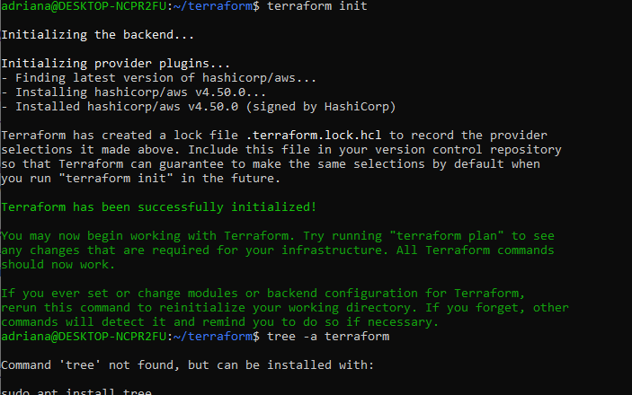
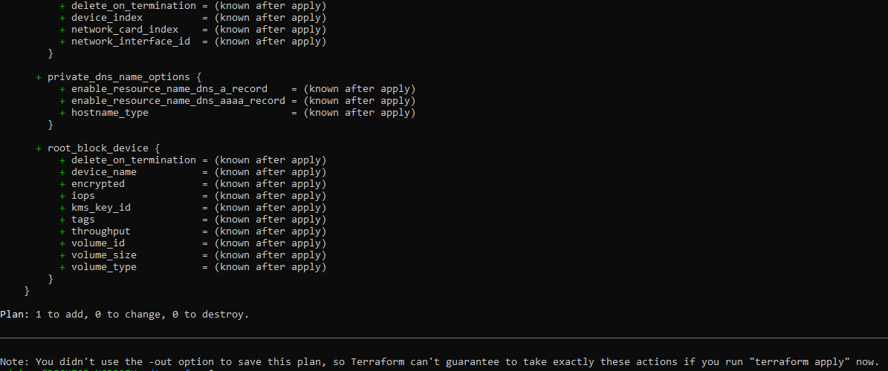
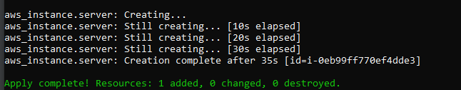

# Terraform

# Introdução

Terraform é uma ferramenta da Hashicorp para construir, modificar e versionar a
infraestrutura de maneira segura e eficiente

- Provider: são responsáveis por interagir com a API e expor os recursos.
 \_ IaaS (Infrastructure as a Service), PaaS (Platform as a Service) ou Saas (Softwares as a Service)

- Provisioners são responsáveis por provisionar o ambiente

# Como executar

- Download Providers 
```cmd
$ terraform init
```


- Planejamento infraestrutura
```cmd
$ terraform plan
```



- Aplicar o plano

```cmd
$ terraform apply
```



- Verificar instancia:

Acesar o painel da AWS
Consultar EC2 

- Para destruir a instância 

```cmd
$ terraform destroy
```